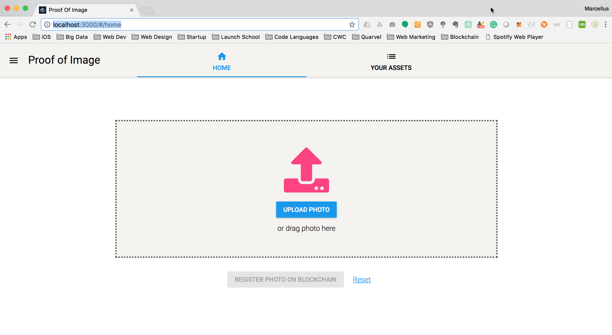

# Consensys Developer Academy 2018 - POE Image dApp

Final Project for the Consensys 2018 Developer course by Marcellus Spears.
This project allows a user to prove he/she is the unique author/creator of a digital image.

---

## User Story

- User uploads unique image to the dApp.
- User registers image on blockchain with email and unique MetaMask account.
- User creates a unique SHA256 Hash of the users image.
- User confirms the transactions details and pulls up MetaMask modal.
- User submits the transaction and successfully registers the asset on the blockchain.

---

## Requirements

- Truffle
- Ganache
- MetaMask
- React
- Redux
- React-Router
- Material-UI
- Zeppelin

---

## Installation

1. Clone the project

   ```javascript
   $ git clone https://github.com/plaidpizazz/poe-image-dapp.git
   ```

2. Change to Project Directory

   ```javascript
   $ cd poe-image-dapp
   ```

3. Install truffle and an ethereum client. For local development, try EthereumJS TestRPC.

   ```javascript
   $ npm install -g truffle // Version 3.0.5+ required.
   $ npm install -g ethereumjs-testrpc
   ```

4. Install your Ethereum client

   ```javascript
   $ npm install -g ganache-cli
   ```

---

## Setting up the Project

1. Change to Project Directory

   ```javascript
   $ cd poe-image-dapp
   ```

2. Start your Ethereum client

   ```javascript
   $ ganache-cli
   ```

3. Compile and migrate the contracts.

   ```javascript
   $ truffle compile
   $ truffle migrate
   ```

4. Run the webpack server for front-end hot reloading.
   ```javascript
   $ npm run start
   ```

---

## Testing the User Interface

1. Open localhost in web browser, 'http://localhost:3000'. You should see the following homepage.

<p style="text-align:center;"></p>

2. Follow on-screen prompts to upload an image. Click Upload Photo

3. Select an image from your computer. Click Open

4. Register the image on blockchain. Click Register Photo on Blockchain.

5. Enter your email and MetaMask account. This will check if image has already been registered.

6. A unique SHA-256 Hash is created of your photo. Click Next.

7. Confim the transaction details. Click Register.

8. Submit transaction on MetaMask.

---

## Testing the Smart Contract

1. Jest is included for testing React components and Truffle's own suite is incldued for smart contracts. Be sure you've compile your contracts before running jest, or you'll receive some file not found errors.

1. Change to Project Directory

   ```javascript
   $ cd poe-image-dapp
   ```

1. Run Desired Test

   ```javascript
   // Runs Jest for React component tests.
   $ npm run test

   // Runs Truffle's test suite for smart contract tests.
   $ truffle test
   ```

---

## Documentation

- [Design Patter Decisions]
- [Avoiding Common Attacks]

---

## FAQ

- **Why is there both a truffle.js file and a truffle-config.js file?**

  Truffle requires the truffle.js file be named truffle-config on Windows machines. Feel free to delete the file that doesn't correspond to your platform.
